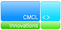
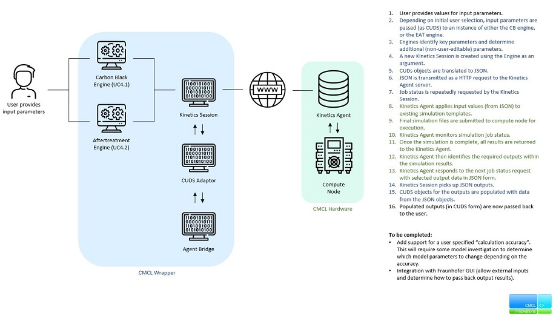

# SimCMCLKinetics
SimPhoNy wrapper for the CMCL's "*k*inetics & SRM Engine Suite" software.

## Requirements
- Python 3.7 (or higher)
- Build the OSP Core library
- Install the CMCL sample ontology using `pico install cmcl.ontology.yml`

## Build instructions
Once all requirements and libraries are installed, build the code by running `pip install -e .` from the root directory.

## Execution
To execute the wrapper, simply run any of the example scripts. Launch settings for use with Visual Studio Code have been provided to run these files.

Each example file has been created to generate the expected inputs (with sample values) for each of the four SimDOME use cases attributed to CMCL.

## Current Limitations
- The "calculation accuracy" setting listed in the initial deliverable plan is not yet implemented.
- CUDS objects are generated from a sample CMCL ontology and set using sample input values. This should be replaced with the CUDS objects (generated from the EMMO) passed from the Fraunhofer UI.
- Remote simulation results are currently translated to CUDS objects and written to file, this will need to be passed back to the Fraunhofer UI when such a framework exists.

## Workflow
When one of the example scripts is executed, the wrapper currently does the following:

- Input CUDS objects are created by the example script
- A new KineticsEngine instance is created (using either the CarbonBlackEngine or EATEngine concrete classes)
- Key parameters are identified to determine which simulation template should be used
- That engine instance is passed to a new KineticsSession as an argument
- Input CUDS objects are written to file for inspection
- Input CUDS objects are translated to JSON
- JSON is transmitted as a HTTP request to the remote KineticsAgent server
	- From this point on, the AgentBridge class continually contacts the KineticsAgent server to request the simulation status
- KineticsAgent applys JSON inputs to the relevant simulation template
- Final simulation files are sent to compute node for execution
	- Once complete, the KineticsAgent identifies the requested outputs from the simulation and will repsond with then upon the next check from the AgentBridge
- JSON outputs are recieved from the remote KineticsAgent
- Results from JSON are parsed into new CUDS objects
- CUDS outputs are written to file for inspection

## Contact
For questions, issues, or suggestions, please contact mdhillman<@>cmclinnovations.com