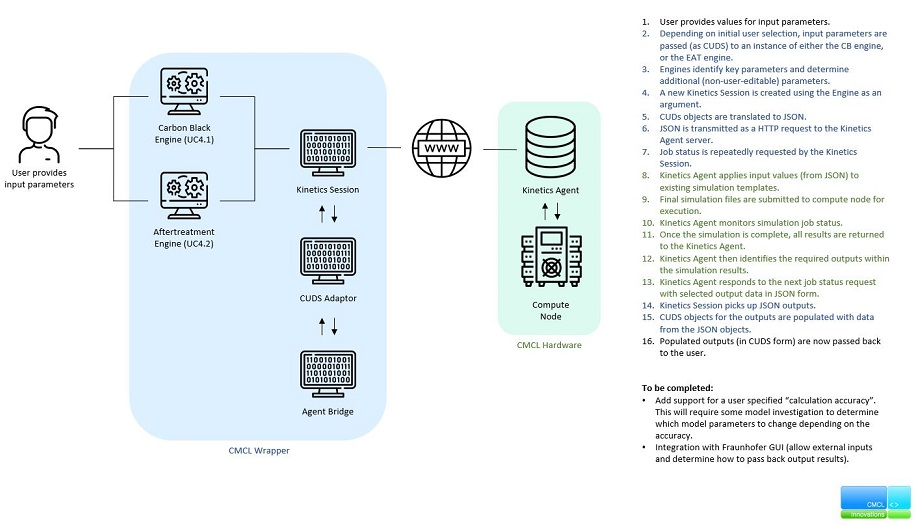

# Usage

This SimPhoNy wrapper for the CMCL's "*k*inetics & SRM Engine Suite" can be 
applied to three use-cases:

- [Carbon Black (Method of Moments and Stochastic Solver)](#carbon-black)
- [Exhaust-After-Treatment: Three-Way-Catalyst (EAT-TWC)](#exhaust-after-treatment-three-way-catalyst)
- [Exhaust-After-Treatment: Gasoline Particle Filter (EAT-GPF)](#exhaust-after-treatment-gasoline-particle-filter)

The simulation inputs must be instantiated as 
[CUDS objects](https://simphony.readthedocs.io/en/v3.9.0/jupyter/cuds_api.html)
using the entities from the `cmcl` and 
[`cuba`](https://simphony.readthedocs.io/en/v3.9.0/working_with_ontologies.html#the-cuba-namespace)
namespaces. The `cmcl` namespace is included in the CMCL ontology (see 
[installation](installation.md)). To access the entities from said namespaces,
import them as follows.

```python
from osp.core.namespaces import CMCL, cuba 
```

Each use-case requires a different pattern of CUDS objects as input. Diagrams
depicting the various patterns are available on the subsections dedicated to 
each use-case. For every use-case, all CUDS objects are part of a `process`
CUDS object that represents the whole simulation process: either a 
`CB_SYNTHESIS_PROCESS` 
([Carbon Black Synthesis](#carbon-black)) or an `EAT_PROCESS`
(Exhaust-After-Treatment: 
[Three-Way-Catalyst](#exhaust-after-treatment-three-way-catalyst) or
[Gasoline Particle Filter](#exhaust-after-treatment-gasoline-particle-filter)).

After the simulation inputs have been defined, it is necessary to pass the 
`process` object to a `KineticsSession`, which needs to be initialized with 
the correct engine and model flag.

```python
from osp.wrappers.simcmclkinetics.kinetics_session import KineticsSession
from osp.wrappers.simcmclkinetics.carbon_black_engine import CarbonBlackEngine
from osp.wrappers.simcmclkinetics.eat_engine import EATEngine

# Create your `process` CUDS object here.
# process = ...

# Initialize a `KineticsSession` with the adequate engine and model flag.
engine = CarbonBlackEngine()  # Carbon Black Synthesis
#  engine = EATEngine()  # Exhaust-After-Treatment
session = KineticsSession(engine)
session.setModelFlag(KineticsSession.CB_MOMIC)  # Carbon Black (Moments Method)
# session.setModelFlag(KineticsSession.CB_STOCHASIC)  # Carbon Black (Stochastic)
# session.setModelFlag(KineticsSession.EAT_GPF)  # EAT: Three-Way-Catalyst
# session.setModelFlag(KineticsSession.EAT_TWC)  # EAT: Gasoline Particle Filter


# Initialize the session with a `Wrapper` object and add the `process` to it.
wrapper = cuba.wrapper(session=session)
wrapper.add(process, rel=CMCL.HAS_PART)
```

Then the simulation is ready to be run. It can be executed using the `run`
method. The simulation outputs are available as new CUDS objects in the same
session. The structures that the output CUDS objects adhere to are depicted on
the same diagrams where the inputs are, on the subsections dedicated to each 
use-case.

```
session.run()

# Process the simulation results.

session.close()
```

If you wish to know more, the [examples section](#examples) covers runnable
code examples that show the usage of the wrapper.

## Carbon Black

Carbon Black (CB) is a nano-sized material that is often regarded as a pure 
form of soot. Many different CB manufacturing methods exist having an 
incomplete combustion or thermal decomposition of gaseous or liquid
hydrocarbons at their cores. CB particles find applications in e.g., tyre,
rubber, plastic, or coating industries where specific particle size
distribution (PSD), surface area or even morphology of produced particles are
required.

This use-case provides an example of the modelling study of the CB formation in
a PFR reactor. The underlying population balance equation is solved using the
method of moments with an interpolative closure (MoMIC) to predict the number
density, volume fraction and average size of the final CB particulate product
at the reactor outlet. The default simulation parameters have been selected
from the experimental work of Ono et al. 
(https://doi.org/10.1016/j.cej.2012.10.085). Please note that the reactor 
temperature is internally imposed and cannot be changed. All calculations were
performed with the kinetics™ software.

<figure style="display: table; text-align:center; margin-left: auto; margin-right:auto">


<figcaption style="display: table-caption; caption-side: bottom; text-align:center">

_Diagram showing the pattern of input CUDS objects that the wrapper expects to
find in the session's knowledge graph and the CUDS objects that are produced 
as simulation outputs for the Carbon Black Synthesis use-case._

</figcaption>
    
</figure>

```{note}
Remember that for this use case, the `KineticsSession` needs to be initialized
with a `CarbonBlackEngine` and its model flag needs to be set either to 
`KineticsSession.CB_MOMIC` or `KineticsSession.CB_STOCHASIC`. 
```

## Exhaust-After-Treatment: Three-Way-Catalyst

Internal combustion engines are important to the transport industry, but they 
produce gaseous emissions including unburnt hydrocarbons, carbon monoxides CO,
nitrogen oxides NOx as well as particulates, which have negative health 
impacts. After-treatment systems are placed behind engine cylinders to convert
these emissions to species that are harmless to human bodies before they exit 
at the tailpipe. There are two types of after-treatment devices: the catalytic
monolith which targets gaseous emissions, and the particulate filters which
trap particles in the exhaust.

This use-case provides an example modelling study of the three-way catalytic
monolith operation capturing CO, NOx and CxHy gaseous emissions. The EAT-TWC
monolith is described via a network of ideal control volumes approach (0D) to
fluid reactive flow through monolithic channels. The coupled cell equations
comprising of generic mass, momentum and energy conservation equations are
solved using the standard ODE solver in the kinetics™ software.

<figure style="display: table; text-align:center; margin-left: auto; margin-right:auto">


<figcaption style="display: table-caption; caption-side: bottom; text-align:center">

_Diagram showing the pattern of input CUDS objects that the wrapper expects to
find in the session's knowledge graph and the CUDS objects that are produced 
as simulation outputs for the Exhaust-After-Treatment: Three-Way-Catalyst
use-case._

</figcaption>
    
</figure>

```{note}
Remember that for this use case, the `KineticsSession` needs to be initialized
with an `EATEngine` and its model flag needs to be set to 
`KineticsSession.EAT_TWC`. 
```

## Exhaust-After-Treatment: Gasoline Particle Filter

Internal combustion engines are important to the transport industry, but they
produce gaseous emissions including unburnt hydrocarbons, carbon monoxides CO,
nitrogen oxides NOx as well as particulates, which have negative health 
impacts. After-treatment systems are placed behind engine cylinders to convert
these emissions to species that are harmless to human bodies before they exit
at the tailpipe. There are two types of after-treatment devices: the catalytic
monolith which targets gaseous emissions, and the particulate filters which
trap particles in the exhaust.

This use-case provides an example modelling study of the gasoline particle
filter operation capturing particulate emissions. The EAT-GPF monolith is
described via a network of ideal control volumes approach (0D) to fluid and
suspended solid reactive flow through monolithic channels. The coupled cell
equations comprising generic mass, momentum, energy and population balance
conservation equations (method of sections) are solved using the standard ODE
solver in the kinetics™ software.

<figure style="display: table; text-align:center; margin-left: auto; margin-right:auto">


<figcaption style="display: table-caption; caption-side: bottom; text-align:center">

_Diagram showing the pattern of input CUDS objects that the wrapper expects to
find in the session's knowledge graph and the CUDS objects that are produced 
as simulation outputs for the Exhaust-After-Treatment: Gasoline Particle Filter
use-case._

</figcaption>
    
</figure>

```{note}
Remember that for this use case, the `KineticsSession` needs to be initialized
with a `EATEngine` and its model flag needs to be set to 
`KineticsSession.EAT_GPF`. 
```

## Examples

The `examples` folder contains a script, `examples_runner.py`, that can be used
to run examples for all use cases. Each example has been created to generate 
the expected inputs (with sample values) for each of the three SimDOME use 
cases attributed to CMCL.

```{include} ../README.md
   :start-after: <!---examples-runner-start-c7140d1f-->
   :end-before: <!---examples-runner-end-c7140d1f-->
```

If you prefer to use Docker to run the kinetics wrapper (see the
[Docker section](installation.md#Docker) on the [installation](installation.md)
page), use the following commands instead:

```{include} ../README.md
   :start-after: <!---examples-runner-docker-start-bc6ec07e-->
   :end-before: <!---examples-runner-docker-end-bc6ec07e-->
```

When the example script is executed, the wrapper does the following:

- Input CUDS objects are created by the example script
- A new KineticsEngine instance is created (using either the CarbonBlackEngine 
  or EATEngine concrete classes)
- Key parameters are identified to determine which simulation template should 
  be used
- That engine instance is passed to a new KineticsSession as an argument
- Input CUDS objects are written to file for inspection
- Input CUDS objects are translated to JSON
- JSON is transmitted as a HTTP request to the remote KineticsAgent server
	- From this point on, the AgentBridge class continually contacts the
      KineticsAgent server to request the simulation status
- KineticsAgent applies JSON inputs to the relevant simulation template
- Final simulation files are sent to compute node for execution
	- Once complete, the KineticsAgent identifies the requested outputs from
      the simulation and will respond with them upon the next check from the
      AgentBridge
- JSON outputs are received from the remote KineticsAgent
- Results from JSON are parsed into new CUDS objects
- CUDS outputs are written to file for inspection

